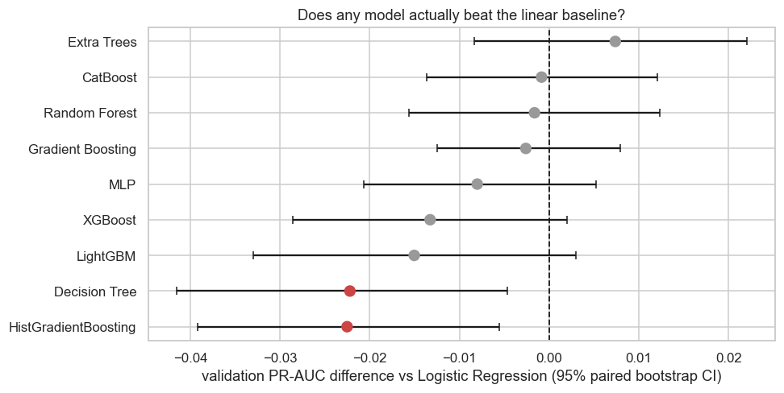
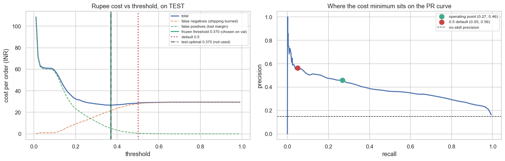
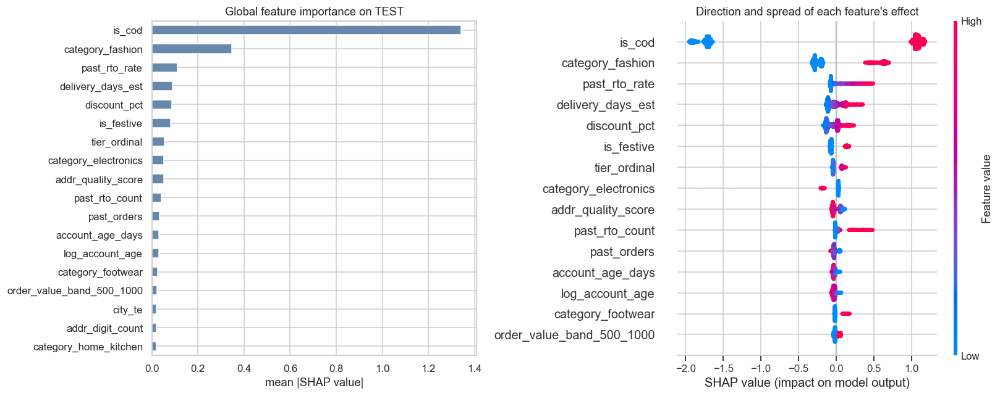
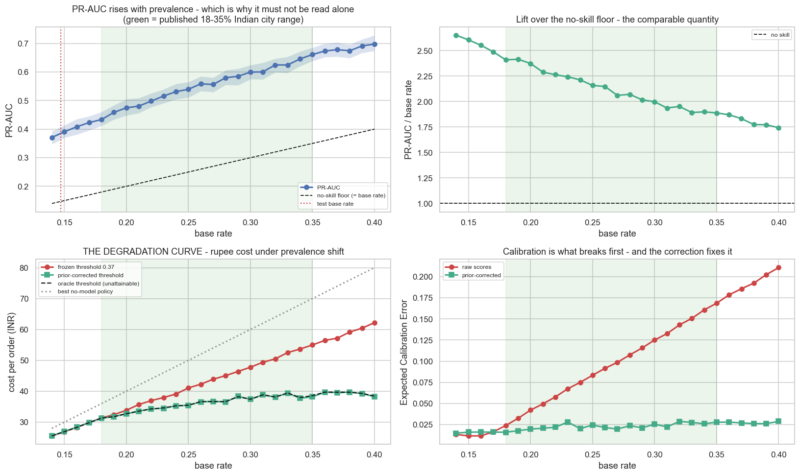
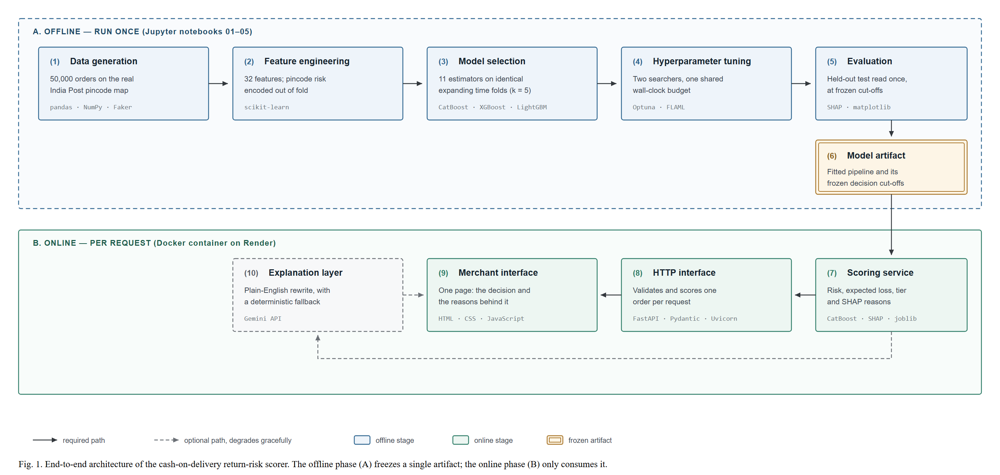
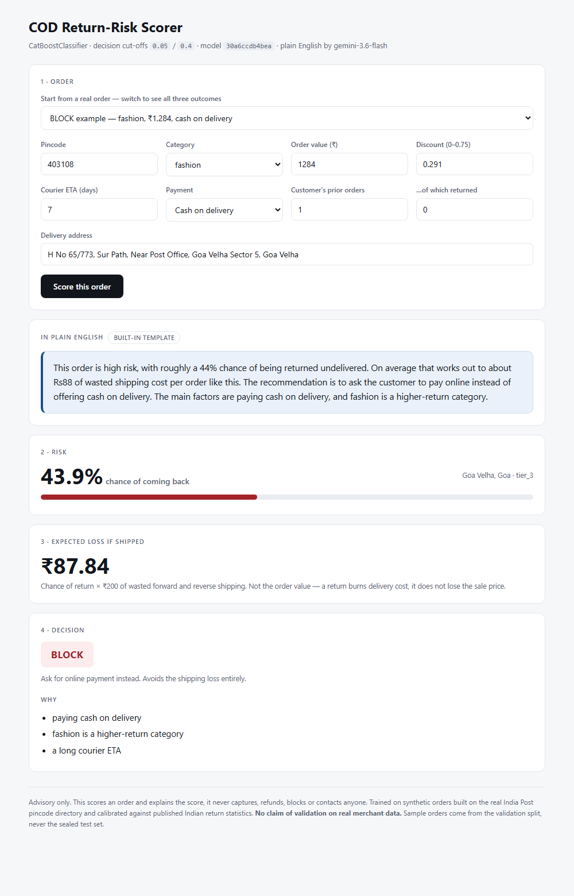
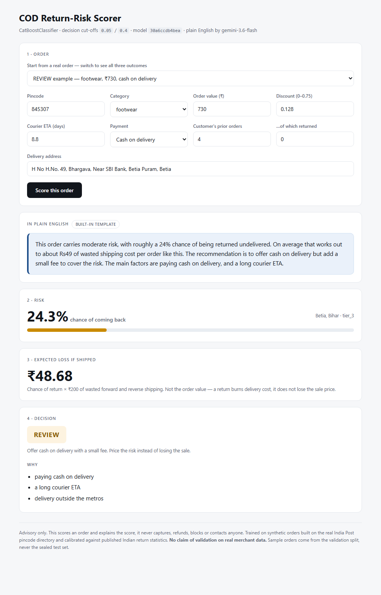
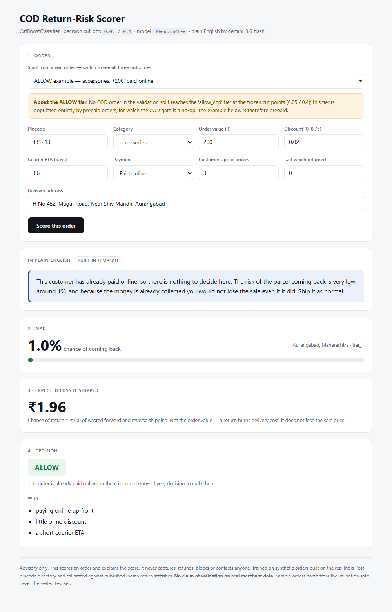

# Return-Risk Scorer

**Stops Indian online sellers losing money on cash-on-delivery orders that come back undelivered.**

Razorpay AI Buildathon 2026 · Track 02, AI Risk Manager

[](https://cod-return-risk-scorer.onrender.com/)
[](https://github.com/lucky07-07/rto-return-risk-scorer/actions/workflows/tests.yml)
[](https://www.python.org/)
[](LICENSE)

FastAPI · CatBoost · scikit-learn · SHAP · Docker

### ▶ [Try it live](https://cod-return-risk-scorer.onrender.com/)

<https://cod-return-risk-scorer.onrender.com/>

It runs on a free instance that sleeps when idle, so the first visit can take about
50 seconds to wake. After that it responds immediately.

[What it gets wrong](#what-it-gets-wrong) · [Results](#results) · [How it was built](#for-the-technically-minded)

---

## The problem, in one paragraph

About 6 in 10 online orders in India are paid cash on delivery. Roughly **1 in 4 of those
never gets delivered**. The customer isn't home, changes their mind, or refuses at the
door. The seller has already paid to ship it out and now pays to ship it back, plus
packaging and handling. Nothing is collected. Across Indian e-commerce that's an estimated
₹8,000 crore a year.

This tool looks at an order **before it ships** and answers one question. Is this one
likely to come back?

## What it does

You give it an order. It gives you four things, in plain English.

| | |
|---|---|
| **How risky** | A percentage chance this order comes back |
| **What it costs** | The rupees you'd expect to waste shipping it |
| **What to do** | Allow cash on delivery, add a small fee, or ask for online payment |
| **Why** | The actual reasons, like a vague address or a customer who has returned before |

It only ever advises. It never blocks a customer, takes money, or contacts anyone.

## Results

### What it's worth

Tested on 10,000 orders the model had never seen.

| | |
|---|---|
| **Money saved** | **₹29,481** against the best you could do with no model at all |
| **Cost of a lazy cut-off** | **₹20,835** — what you'd waste flagging at 50% out of habit instead of at the point where money is actually minimised |
| **Catches** | About 1 in 4 of the orders that would have come back |
| **When it flags an order** | It's right a little under half the time |

That last row matters and it's stated deliberately. This is not a tool that is right every
time. It's a tool that, once you add up the wins and the mistakes in rupees, leaves the
seller better off.

### The charts that carry the argument

Each one is produced by the notebooks and lives in
[`reports/figures/`](reports/figures/). Nothing here was drawn by hand.

### Did any model actually beat a simple one?



Eleven models were compared. The dot is how much better or worse each was than plain
logistic regression, and the whiskers are the range we can actually be confident about.
**Every whisker crosses zero except the two in red, which were worse.** So nothing
sophisticated genuinely beat the simple model, and saying otherwise would be reading
noise as a result.

### Where the money is actually lost



The two dashed lines are the two ways of being wrong. Flag too few orders and you burn
shipping on returns, the rising orange line. Flag too many and you lose good sales, the
falling green line. Total cost is the blue curve, and the cheapest point sits at **0.370**,
not at the 0.5 that most people would reach for. That gap is worth **₹20,835** on 10,000
orders.

### What the model actually looks at



Each row is one input, ordered by how much it moves decisions. Paying cash on delivery
dominates by a wide margin, then whether it is a fashion item, then the customer's own
return history. On the right, red means a high value for that input and blue a low one, so
you can read which direction each factor pushes. Nothing surprising is hiding in here,
which is what you want from a risk model somebody has to defend.

### Does it survive a different kind of customer?



Return rates vary from about 18% in Vadodara to 35% in Patna. This is the model tested
across that whole range, and it is the direct answer to the failure that sinks tools like
this. **The ranking holds everywhere.** What breaks is the *calibration*, the bottom-right
panel, which quietly moves the cheapest threshold to the wrong place. One line of
arithmetic corrects it, cutting the worst-case waste from **₹16.42 to ₹0.08 per order**.

A second study reweights the test set to seven different merchant profiles, from
metro-heavy to small-town, fashion-led to electronics-led. Ranking stays useful in all
seven, and the full table is in [`WHAT_BROKE.md`](WHAT_BROKE.md) #18.

### Every metric, in full

**Headline numbers**, all backed by files in `reports/results/`. The full set, including
per-segment, per-fold and per-profile breakdowns, is in [`reports/METRICS.md`](reports/METRICS.md).

| | Test set | Validation |
|---|---|---|
| PR-AUC | 0.386, which is 2.62× the no-skill floor | 0.397 |
| ROC-AUC | 0.806 | 0.810 |
| Brier score | 0.106 | 0.109 |
| Log loss | 0.336 | 0.344 |
| Expected calibration error | 0.012 | 0.013 |
| Mean predicted probability | 0.151, against a 0.147 base rate | 0.157, against 0.155 |
| Precision / recall / F1 **at the frozen 0.37** | 0.458 / 0.269 / 0.339 | 0.480 / 0.297 / 0.367 |
| Flag rate at 0.37 | 0.0864 | 0.0958 |

The Bayes ceiling for this data is a PR-AUC of 0.555, so the model captures about 70% of it
on test. A score above the ceiling would be evidence of a leak rather than of skill, and the
notebooks assert on it.

**The operating point is 0.37, not 0.5.** That row above is often misread, so here is the
whole trade-off on the test set. The threshold was fixed on validation before the test set
was opened; this table is descriptive and changed no decision.

| Threshold | Precision | Recall | F1 | Flag rate | Cost / order |
|---|---|---|---|---|---|
| 0.20 | 0.333 | 0.688 | 0.449 | 30.47% | ₹32.53 |
| 0.25 | 0.356 | 0.574 | 0.440 | 23.74% | ₹29.32 |
| 0.30 | 0.377 | 0.439 | 0.406 | 17.15% | ₹27.81 |
| 0.35 | 0.432 | 0.312 | 0.362 | 10.65% | ₹26.70 |
| **0.37 ← frozen** | **0.458** | **0.269** | **0.339** | **8.64%** | **₹26.51** |
| 0.40 | 0.477 | 0.193 | 0.275 | 5.95% | ₹27.13 |
| 0.50 | 0.565 | 0.050 | 0.092 | 1.31% | ₹28.60 |

F1 peaks near 0.25, but F1 is not the objective here — rupees are, and the cost minimum sits
at 0.37. The 0.5 default flags barely 1% of orders and costs ₹20,835 more across 10,000
orders, which is the whole argument for choosing a threshold on cost rather than habit.
Full sweep, both splits, in [`reports/results/05_threshold_sweep.csv`](reports/results/05_threshold_sweep.csv).

---

## How it fits together



Editable source, [`docs/architecture_diagram.svg`](docs/architecture_diagram.svg)

## Built with

| Stage | Stack |
|---|---|
| Data generation | pandas, NumPy, SciPy, Faker |
| Modelling | scikit-learn, CatBoost, XGBoost, LightGBM |
| Tuning | Optuna, FLAML |
| Explainability | SHAP, and Google Gemini for the plain-English layer |
| Charts | matplotlib, seaborn |
| Service | FastAPI, Pydantic, Uvicorn, joblib |
| Interface | HTML, CSS and JavaScript; Streamlit as an alternative UI |
| Deployment | Docker, Render |
| Tests | pytest, 55 tests |

Python 3.13, exact versions pinned in [`requirements.txt`](requirements.txt). The container
installs the shorter [`deploy/requirements-serve.txt`](deploy/requirements-serve.txt) instead,
which drops Jupyter, Optuna, FLAML, Streamlit and matplotlib.

---

## Getting started

Everything below is a real command. Nothing to fill in except your own API key, which is
optional.

**1. Clone and enter the project**

```bash
git clone https://github.com/lucky07-07/rto-return-risk-scorer.git
cd rto-return-risk-scorer
```

**2. Create a virtual environment**

```bash
python -m venv .venv
```

```bash
.venv\Scripts\activate
```

On macOS or Linux use `source .venv/bin/activate` instead.

**3. Install the dependencies**

```bash
pip install --only-binary=:all: -r requirements.txt
```

The `--only-binary` flag matters. Without it pip tries to compile CatBoost from source and
fails after several minutes.

**4. Add a Gemini key, optional**

```bash
cp .env.example .env
```

Open `.env` and paste a free key from [Google AI Studio](https://aistudio.google.com/apikey).
Skip this and everything still runs, you just get the built-in summaries instead of
Gemini-written ones.

**5. Run the demo**

```bash
uvicorn api.main:app --reload
```

Open <http://127.0.0.1:8000>. The page loads with a real order already filled in, so a
decision appears immediately. Use the dropdown to switch between a safe order, a middling
one and a risky one. Interactive API documentation is at <http://127.0.0.1:8000/docs>.

**6. Run the tests**

```bash
pytest -q
```

55 tests covering data calibration, leakage guards, the API contract and the
plain-English fallback.

**7. Rebuild the model from scratch, optional**

The trained model ships with the repository, so this is only needed to reproduce the whole
pipeline. Run the notebooks in order, `01` through `05`. Notebook `01` generates the data
everything else depends on.

```bash
jupyter lab
```

---

## Project structure

```
api/            Web service and the one-page demo UI
app/            Alternative Streamlit interface, optional
config/         Published statistics the generated data is calibrated against
data/external/  Real India Post pincode directory, 39,736 post offices
deploy/         Dockerfile and the serving-only dependency list
docs/           Architecture diagram and demo screenshots
models/         The trained model plus its decision cut-offs, one file
notebooks/      The full build, 01 to 05, run in order
reports/        Every chart and every metric, written by the notebooks
src/            The reusable code the notebooks and the web service both import
tests/          Calibration, leakage, API and fallback tests
```

---

## For the technically minded

Everything above is deliberately free of jargon. The rigour is all still here, in these documents.

| Document | What's in it |
|---|---|
| [`PRE_REGISTRATION.md`](PRE_REGISTRATION.md) | Metrics, cost model and thresholds fixed **before** any model was trained, then git-tagged |
| [`DATA_CARD.md`](DATA_CARD.md) | What is real, what is generated, the full schema, and every limitation |
| [`ARCHITECTURE.md`](ARCHITECTURE.md) | System design, feature groups and the reproducibility contract |
| [`WHAT_BROKE.md`](WHAT_BROKE.md) | 21 entries on what went wrong and how it was fixed, including the embarrassing ones |
| [`reports/METRICS.md`](reports/METRICS.md) | **Every metric the project produced**, in ten tables, generated from `reports/results/` |

**Method in brief.**

- 50,000 orders split by time, 70/10/20. Never randomly, which would leak the future.
- Generated data calibrated against published Indian statistics and enforced by test rather
  than asserted in prose. `pytest tests/test_calibration.py` fails the build if the return
  rates drift.
- The order-value curve is deliberately non-monotonic. Risk peaks in the ₹500 to ₹1,000 band
  and falls above ₹1,000, which is what the published data shows and the opposite of the
  intuitive assumption.
- Pincode history is target-encoded out of fold. Doing it the naive way inflates the
  apparent score by 0.17 AUC, which notebook `02` measures rather than assumes.
- 11 models benchmarked on identical folds, then Optuna and FLAML compared head to head on
  an identical wall-clock budget.
- The test set was opened once, at settings frozen on validation beforehand.
- Performance is reported across the full 18% to 35% return range seen across Indian cities,
  so behaviour under a shifted base rate is measured rather than assumed.

---

## What it gets wrong

Nothing here is hidden. Each limitation gets a plain-English version first.

**The data is generated, not real.**
There is no public dataset of Indian cash-on-delivery orders with return outcomes, so the
orders were built to match published Indian statistics rather than taken from a real shop.
The geography is real, the India Post directory of 39,736 post offices. The statistics it is
tuned to are real and published. The orders themselves are not. **No claim is made that this
has been validated on real merchant data.**

**It helps least the sellers who need it most.**
A seller whose orders are almost all cash on delivery gets the weakest performance, because
the single most useful clue, whether the customer chose to pay cash, is then the same for
every order they have. It still beats doing nothing, but such a seller should expect the
lower end of the range.

**The "allow" tier never actually fires for a cash order.**
Every cash-on-delivery order gets either a fee or a request for online payment. Nothing is
waved straight through. That falls out of the economics assumed for the fee, and it is
reported rather than tidied away.

**Two numbers in the cost model are guesses.**
The fee amount, and how many customers walk away when shown a fee, have no published source.
The main threshold does not depend on them and is solid. The three-tier split does depend on
them and should be treated as provisional.

**A simple model did just as well.**
Plain logistic regression matched everything more sophisticated. Tuning made the model
slightly worse on unseen orders. Both findings are reported in full rather than buried.

---

## Defence-only, by construction

This system reads order details and returns a number, a recommendation and an explanation.

It has no code path that captures a payment, issues a refund, blocks an account, cancels an
order or contacts a customer. The recommendation is advice. Acting on it is the seller's
decision. There is nothing here that could be repurposed to commit fraud.

---

## Deploying it yourself

The whole demo is one container, the API and the page together on a single URL.

The repository includes a [`render.yaml`](render.yaml) blueprint, so Render configures
the service itself.

1. Go to <https://dashboard.render.com/blueprints> and choose **New Blueprint Instance**
2. Connect this GitHub repository
3. Render reads `render.yaml` and creates the service, no manual settings needed
4. Under the service's **Environment**, add `GEMINI_API_KEY` with your own key

Step 4 is optional. Without it the plain-English summaries come from the built-in
template instead of Gemini, and everything else works normally.

The free instance sleeps after 15 minutes of inactivity, so the first visit after a
quiet spell takes about 50 seconds to wake up. Measured runtime memory is 261 MB
against the free tier's 512 MB limit.

`deploy/requirements-serve.txt` is deliberately smaller than `requirements.txt`. The
container has no reason to carry Jupyter, Optuna, FLAML, Streamlit or matplotlib, and a
check confirms nothing outside that shorter list is imported at serving time.

### A note on the hosts I tried first

**Vercel cannot run this.** Its Python functions cap at 250 MB unzipped. CatBoost alone
is 353 MB and the minimum serving set is about 600 MB, so no arrangement fits without
dropping the real model.

**Hugging Face Spaces now needs a paid plan** for Docker Spaces on any tier, including
free CPU. Only Static Spaces are free, and those cannot run a Python service.

## Demo

Three real orders, scored by the live model. Switch between them in the dropdown.

**A risky order, so the tool says ask for online payment**



**A middling order, so the tool says allow cash on delivery but add a fee**



**A safe order, so the tool lets it through**



The blue box at the top of each is written by Google Gemini, which turns the raw numbers
into something a shop owner can read. If the Gemini key is missing or its free quota is used
up, the app writes the same summary itself and carries on working.

---

## Licence

[MIT](LICENSE)

## Citation

Machine-readable metadata is in [`CITATION.cff`](CITATION.cff); GitHub renders a
*Cite this repository* button from it.

## Author

Anil Kumar
